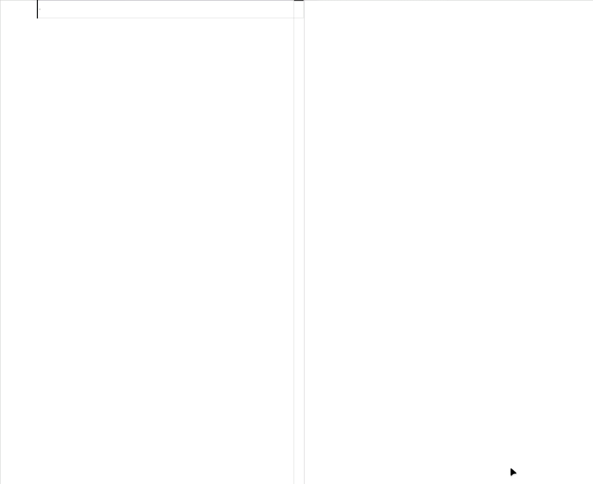

 

<h1> Jotdoc</h1>

A more capable, legible Markdown

 [Use in Code]() ⠀ · ⠀ [Make it better](https://github.com/Acumane/jotdoc/discussions)

### Why?

Markdown set out to make ease of **reading, writing, and editing prose**. Its key design goal was **readability**—that the language be readable as-is, **unencumbered by syntax**.

HTML in Markdown deteriorates readability, yet a striking number of common use cases require it 🤔

 

## ✨ Features

- Effortless column blocks ⠀[`columns` 🡭](@jotdoc/columns/README.md)⠀

- Shift any content left/center/right (+ image wrap) ⠀[`align` 🡭](@jotdoc/align/README.md)⠀

- Unified syntax for images and text: set links, colors, image sizes, and more ⠀[`unify` 🡭](@jotdoc/unify/README.md)⠀

- Simple block comments ⠀[`comments` 🡭](@jotdoc/comments/README.md)⠀

- User-defined pattern substitutions ⠀[`replace` 🡭](@jotdoc/replace/README.md)⠀

- Line break/escape from image wrapping ⠀[`break` 🡭](@jotdoc/break/README.md)⠀

- Skew simple fractions like⠀□ ⁄ □ ⠀[`skew` 🡭](@jotdoc/skew/README.md)⠀

### Support
- [x] [**Code**](support/vscode)

  Extension imports Jotdoc plugins, contributes styles and syntax grammars, and exposes plugin options in settings

  

❤️

